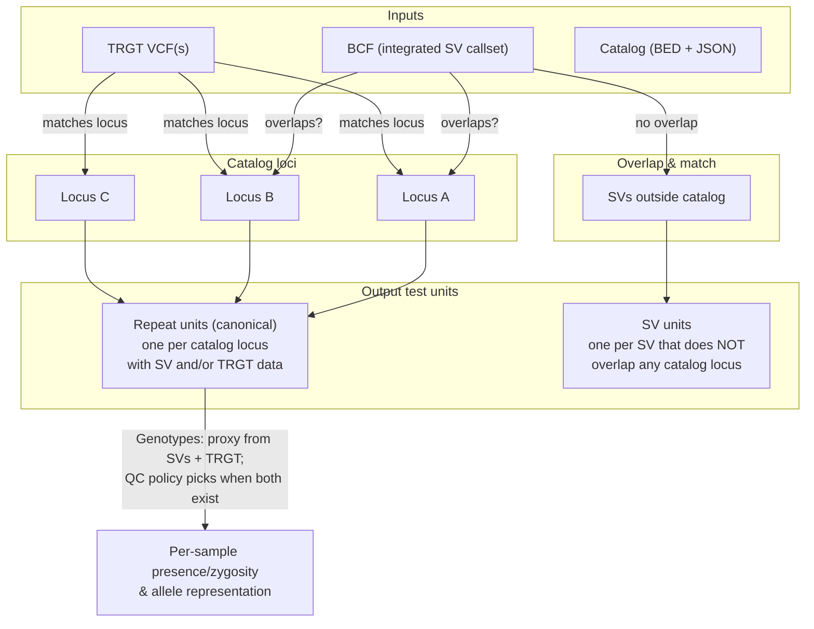
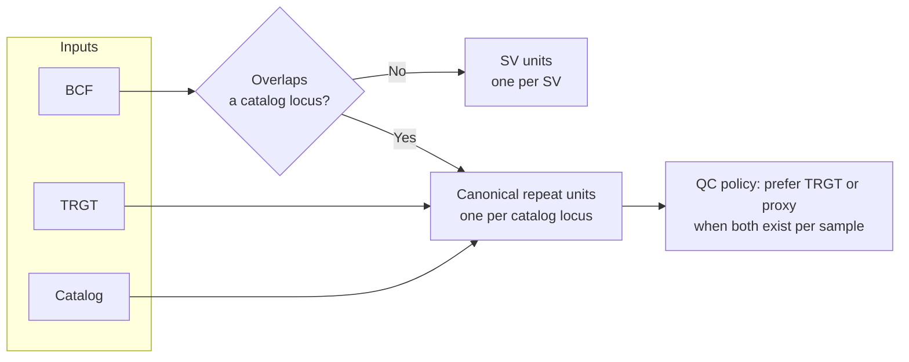

# How STORM Combines Test Units

This document describes how inputs (BCF, TRGT, catalog) are combined into **test units** for association testing. Catalog loci are the canonical unit for repeats; SVs and TRGT contribute to those units or become standalone SV units.

---

## Diagram (Mermaid)



---

## Same flow (simplified)



---

## ASCII sketch

```
                    ┌─────────────┐
                    │   Catalog   │
                    │ (BED+JSON)  │
                    └──────┬──────┘
                           │
                           ▼
              ┌────────────────────────────┐
              │   Canonical repeat loci     │
              │   (one unit per locus      │
              │    with SV or TRGT data)   │
              └────────────┬───────────────┘
                           │
        ┌──────────────────┼──────────────────┐
        │                  │                  │
        ▼                  ▼                  ▼
   ┌─────────┐       ┌─────────┐       ┌─────────┐
   │   BCF   │       │  TRGT   │       │   BCF   │
   │ (SVs)   │       │ (VCFs)  │       │ (SVs)  │
   └────┬────┘       └────┬────┘       └────┬────┘
        │                 │                 │
        │ overlap?        │ match locus     │ no overlap
        │                 │                 │
        ▼                 ▼                 ▼
   ┌─────────┐       ┌─────────┐       ┌─────────┐
   │  Feed   │       │  Feed   │       │  Emit   │
   │ repeat  │       │ repeat  │       │ sv_<id> │
   │  unit   │       │  unit   │       │  unit   │
   │ (proxy  │       │ (true   │       │ (stand- │
   │ allele) │       │  allele)│       │  alone) │
   └────┬────┘       └────┬────┘       └─────────┘
        │                 │
        └────────┬────────┘
                 │
                 ▼
        ┌─────────────────┐
        │  QC policy:      │
        │  prefer TRGT or  │
        │  proxy per       │
        │  sample when     │
        │  both exist      │
        └─────────────────┘
```

---

## Summary

| Source | Overlaps / matches a catalog locus? | Result |
|--------|-----------------------------------|--------|
| **BCF (SV)** | Yes | Contributes to that **repeat unit** only (presence/zygosity + proxy allele). No separate `sv_<id>` unit. |
| **BCF (SV)** | No | Becomes its own **SV unit** (`sv_<id>`). |
| **TRGT** | Matches a catalog locus | Contributes to that **repeat unit** (true repeat allele). QC policy chooses proxy vs TRGT when both exist for a sample. |
| **Catalog** | — | Defines **canonical repeat units** (one per locus that has SV and/or TRGT data). |

Optional **comparison mode** can emit shadow `repeat_<trid>` units (one per TRGT locus) for validation; default is off.

---

## Genotypes at a repeat locus

For each sample at a catalog repeat locus, the QC policy picks **one representation** (TRGT or proxy). We then take the **full genotype** from that source — we do not mix sources.

| QC choice for that sample @ locus | We use |
|-----------------------------------|--------|
| **TRGT** (available and pass) | Full TRGT genotype: presence, zygosity, and allele lengths from TRGT. |
| **Proxy** (no TRGT or TRGT fail) | Full SV-derived genotype: presence, zygosity, and proxy allele from overlapping SV(s). |

So: if we take TRGT alleles, we always take TRGT genotypes (presence/zygosity) for that sample at that locus; if we take proxy, we take the SV-derived presence/zygosity and proxy allele.
